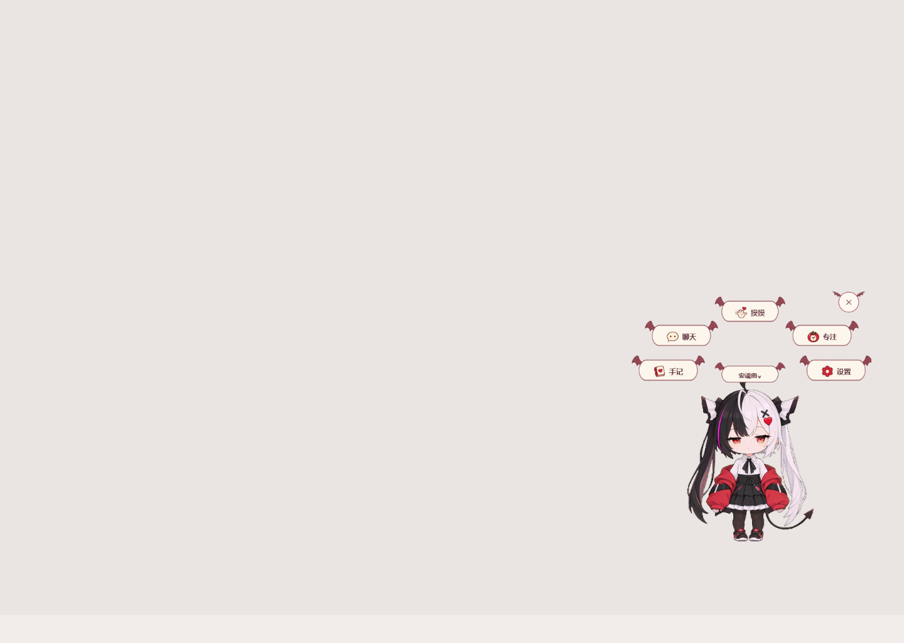
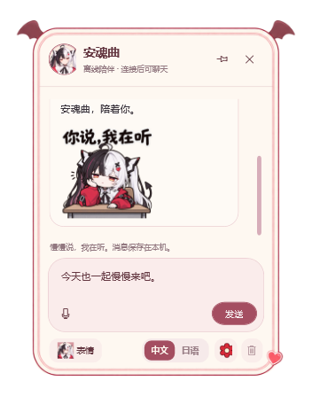
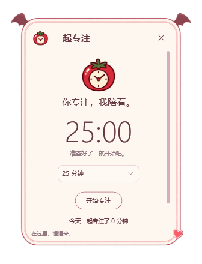
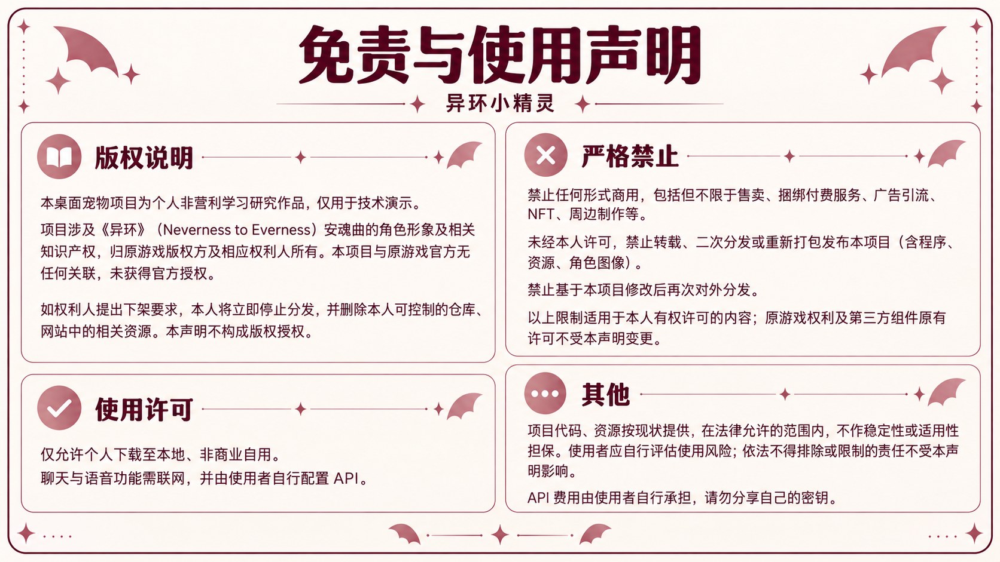

  

<h1 align="center">异环小精灵</h1>

<b>「鉴定师，安魂曲在。」</b> 一只住在 Windows 桌面上的小精灵。聊聊天，摸摸头，也一起安静待一会儿。

  <a href="https://github.com/zhisandesu/yihuan-desktop-pet/releases/latest">下载 Windows 程序</a> ·
  <a href="docs/画廊.md">壁纸与表情画廊</a> ·
  <a href="docs/使用前请读.txt">使用说明</a> ·
  <a href="https://github.com/zhisandesu/yihuan-desktop-pet/issues">反馈问题</a>

Windows 10 / 11 x64 · 68 组动画 · 44 张表情 · 中文 / 日语语音

## 在桌面上，陪你过一小段日常

角色直接待在桌面上。右击她，小翅膀菜单就会展开；聊天、摸摸、专注、手记和设置，都藏在这里。

| 小小的互动 | 自己的节奏 | 有来有回的陪伴 |
| --- | --- | --- |
| 摸头、轻点、抓起、放下。拖拽时立即进入抓起／悬挂动作。 | 走路、坐下、打哈欠、趴下睡觉，也会变成小蝙蝠休息。 | 根据聊天和互动生成台词，配合表情与动作；主动闲聊可在设置关闭。 |

## 聊一会儿，也可以一起专注

<table>
  <tr>
    <td align="center"></td>
    <td align="center"></td>
  </tr>
  <tr>
    <td><b>文字、语音与表情</b> 支持文字聊天、麦克风语音对话，以及回复朗读。日配模式下，聊天文字仍默认显示中文。</td>
    <td><b>留一点自己的时间</b> 专注计时、心情手记、角色记忆；可以调整角色大小、面板透明度和陪伴节奏。</td>
  </tr>
</table>

界面截图使用演示内容。角色台词由模型生成，是本项目二创，非游戏原台词。

## 今天的表情

<table>
  <tr>
    <td align="center"> 你说，我在听</td>
    <td align="center"> 番茄，给我</td>
    <td align="center"> 早呀</td>
    <td align="center"> 在干嘛</td>
  </tr>
</table>

程序内置 44 张表情，会在部分对话中触发；画廊精选 8 张，可以打开原图。**[去看看更多表情 →](docs/画廊.md#表情小相册)**

## 两种时间，一样的陪伴

| 午后的番茄 | 晚安之前 |
| --- | --- |
|  |  |
| 奶油色日光，给桌面留一点空白。 | 窗外亮起灯，她还坐在这里。 |

点击预览打开原图，再选择 **Download raw file** 保存。两张壁纸为 AI 辅助创作，原图尺寸均为 1672 × 941，接近 16:9；仅供个人本地、非商业自用。

## 把她带到桌面

1. 在 **[最新版本](https://github.com/zhisandesu/yihuan-desktop-pet/releases/latest)** 下载 `YihuanCompanion-1.0.7.2-Windows-x64.zip`。不要下载 GitHub 自动生成的 Source code 包，那只是仓库文档。
2. **完整解压**，双击 `YihuanCompanion.exe`。已包含 .NET 桌面运行环境。
3. 右击角色 → 设置 → 连接与声音，填写自己的 API Key 与可用模型。
4. 先点“试听当前复刻音色”，再开始聊天。默认中文，默认开启回复朗读。

**已有旧版：** 下载 Release 中的 `YihuanCompanion-Update-to-1.0.7.2.zip`，彻底退出程序后解压覆盖原程序目录。适用于 v1.0.0–v1.0.3 完整包和本地 1.0.4–1.0.7.1；补丁不能单独运行，也不会替换你的个人 Key、设置和聊天记录。

**v1.0.7.2 本次调整：** 聊天结合语境执行动作，加入番茄小游戏与屏边探头；修复朗读结束后的状态显示，恢复句首“唔、嗯”等语气词。首次出声等待缩短，保留原语速与音色。详见 **[完整更新说明](docs/releases/v1.0.7.2.md)**。

语音偶尔音高或语速变化、名字停连仍可能出现，本版未宣称彻底修复。

<b>语音怎么配置？填一次 Key 就够吗？</b>

已预置安魂曲中文／日语复刻音色 ID、模型和采样参数。使用阿里 Token Plan 聊天时，语音共用同一份 Key；使用其他聊天服务时，另填阿里 Token Plan 语音 Key。

预置 ID 不会转移云端账号权限：Key 仍须能够访问该复刻音色。跨账号若提示无权限或音色不存在，请在“高级 · 更换复刻音色”中填入该账号的音色 ID。**不会回退到系统默认声音；未承诺任意账号的 Key 都能调用预置音色。**

如果试听正常但聊天没有朗读，检查“回复后实时朗读”和“安静陪伴”开关；状态栏会显示等待、朗读或失败原因。

<b>离线能用什么？数据存在哪里？</b>

未配置 API 时，可以使用本地角色、拖拽、菜单与动作。聊天、语音和主动台词需要联网及对应服务。程序未做代码签名；已在本机验证，其他设备兼容性仍需反馈。

发布包不含作者的 API Key、个人设置或聊天记录。用户密钥与聊天记录保存在当前 Windows 用户的本机数据目录，并使用系统加密。

联网聊天会发送输入、必要上下文与保存的记忆；语音识别会发送录音，朗读会发送待朗读文字。API 费用由使用者自行承担。请勿在 Issue、截图或分享文件中包含密钥和私人对话。

## 使用范围与权利说明

个人非营利学习研究作品，仅允许个人本地、非商业自用。本项目与《异环》官方无关联、未获官方授权，相关角色知识产权归原游戏版权方及相应权利人所有。

禁止商用、未经许可转载或二次分发、重新打包发布、修改后再次对外分发。上述限制仅适用于作者有权许可的内容，不改变原游戏权利及第三方组件许可。完整条款见 **[免责与使用声明](NOTICE.txt)**；第三方许可随程序包提供。

此仓库用于程序分发、说明和问题反馈，**不提供开源授权**。壁纸、表情和页面图片同样遵守以上使用范围。

查看完整声明图片

