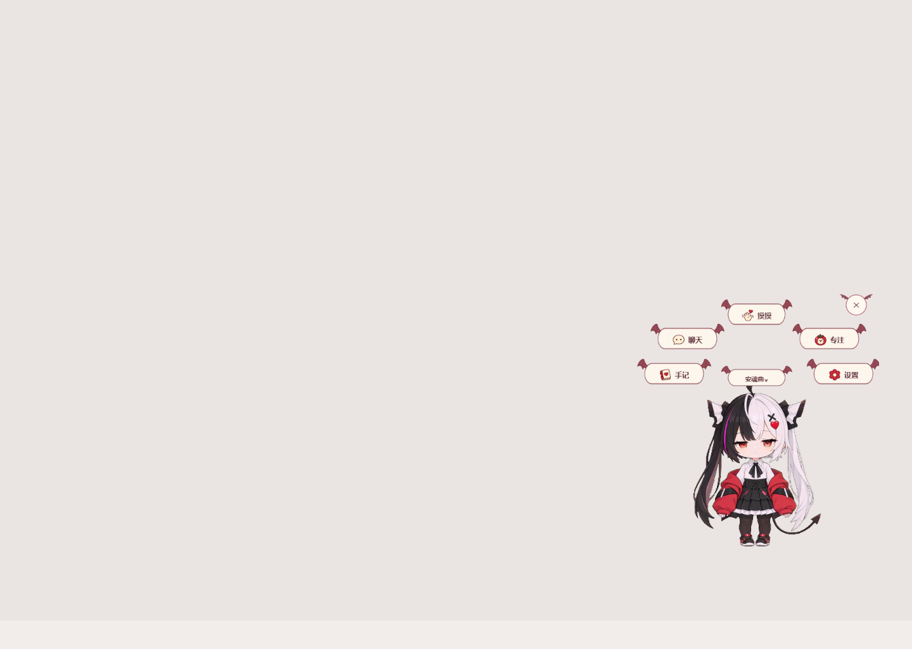
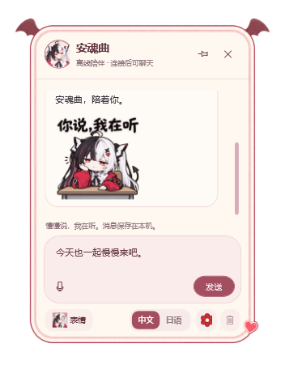
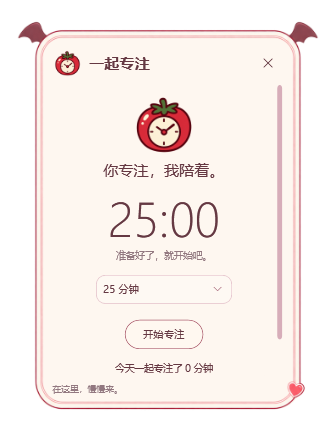
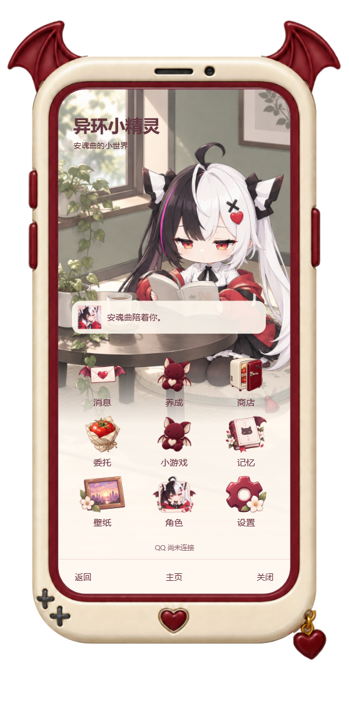
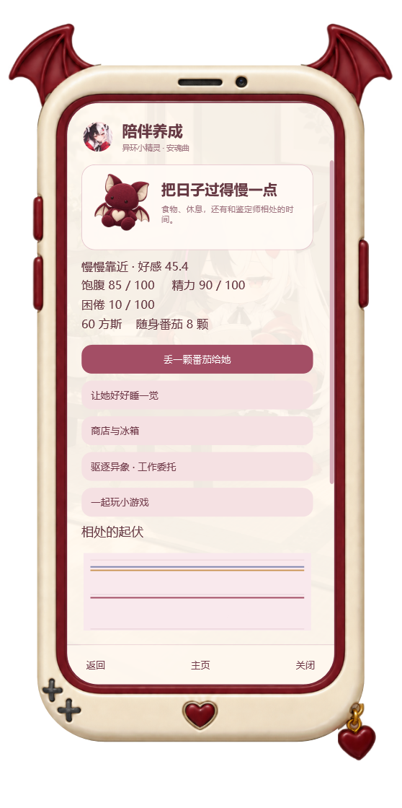
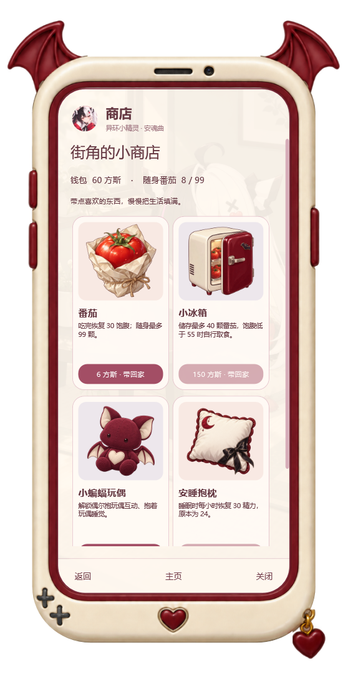
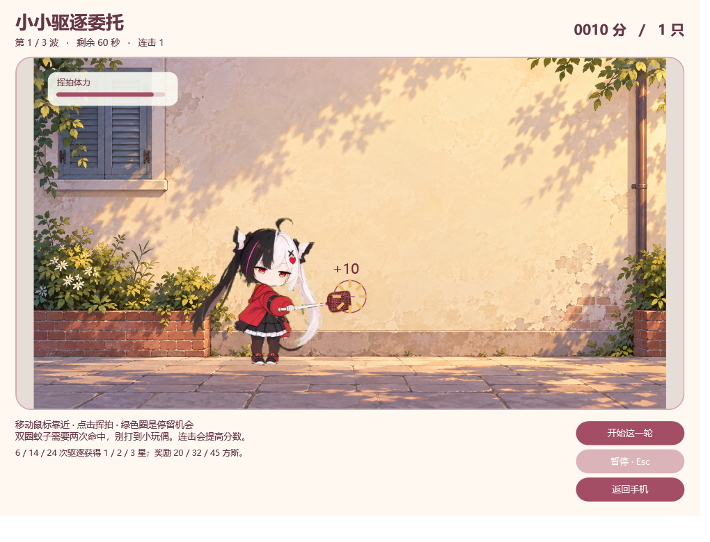
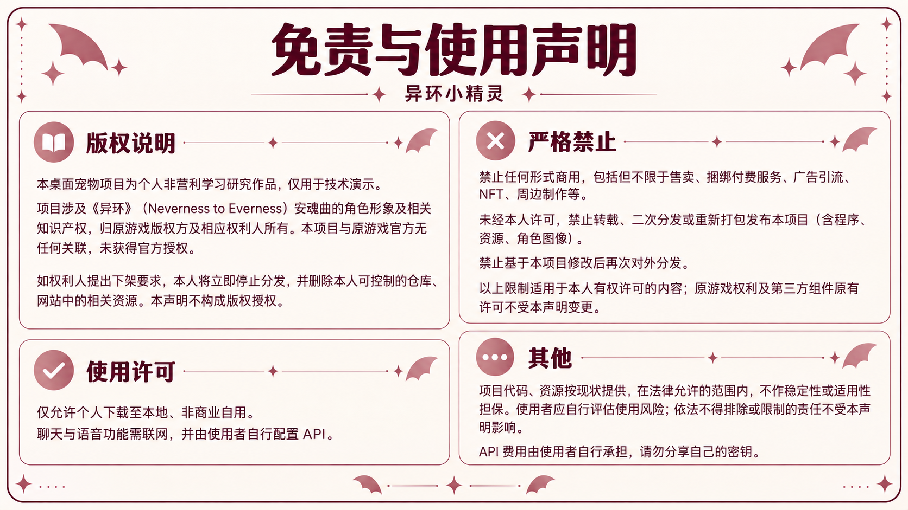

  

<h1 align="center">异环小精灵</h1>

<b>「鉴定师，安魂曲在。」</b> 一只住在 Windows 桌面上的小精灵。聊聊天，摸摸头，也一起安静待一会儿。

  <a href="https://github.com/zhisandesu/yihuan-desktop-pet/releases/latest">下载 Windows 程序</a> ·
  <a href="docs/画廊.md">壁纸与表情画廊</a> ·
  <a href="docs/使用前请读.txt">使用说明</a> ·
  <a href="https://github.com/zhisandesu/yihuan-desktop-pet/issues">反馈问题</a>

v2.0 · Windows 10 / 11 x64 · 手机界面 · 陪伴养成 · QQ 同步 · 中文 / 日语语音

## 在桌面上，陪你过一小段日常

角色直接待在桌面上。右击她，小翅膀菜单就会展开；聊天、摸摸、专注、手记和设置，都藏在这里。

| 小小的互动 | 自己的节奏 | 有来有回的陪伴 |
| --- | --- | --- |
| 摸头、轻点、抓起、放下。拖拽时立即进入抓起／悬挂动作。 | 走路、坐下、打哈欠、趴下睡觉，也会变成小蝙蝠休息。 | 根据聊天和互动生成台词，配合表情与动作；主动闲聊可在设置关闭。 |

## 聊一会儿，也可以一起专注

<table>
  <tr>
    <td align="center"></td>
    <td align="center"></td>
  </tr>
  <tr>
    <td><b>文字、语音与表情</b> 支持文字聊天、麦克风语音对话，以及回复朗读。日配模式下，聊天文字仍默认显示中文。</td>
    <td><b>留一点自己的时间</b> 专注计时、心情手记、角色记忆；可以调整角色大小、面板透明度和陪伴节奏。</td>
  </tr>
</table>

界面截图使用演示内容。角色台词由模型生成，是本项目二创，非游戏原台词。

## 今天的表情

<table>
  <tr>
    <td align="center"> 你说，我在听</td>
    <td align="center"> 番茄，给我</td>
    <td align="center"> 早呀</td>
    <td align="center"> 在干嘛</td>
  </tr>
</table>

程序内置 44 张表情，会在部分对话中触发；画廊精选 8 张，可以打开原图。**[去看看更多表情 →](docs/画廊.md#表情小相册)**

## 安魂曲的小手机

右击角色打开手机。消息、角色、壁纸、情绪、记忆、养成、商店、委托和小游戏都放在同一个手机界面里，可以切换壁纸。

<table>
  <tr>
    <td align="center"></td>
    <td align="center"></td>
    <td align="center"></td>
  </tr>
</table>

聊天、照顾和投喂会影响好感，频繁拖动或打扰睡觉也会影响她的状态。饱腹与精力缓慢变化，离线不补扣。番茄可以在桌面投喂；冰箱存放食物，玩偶解锁抱偶互动和睡眠。角色人设保持固定，熟悉度与长期记忆从真实对话中成长；记忆可在手机查看管理。

## 驱逐异象，赚一点方斯

手机 → 委托，进入 60 秒三波打蚊子关卡。移动鼠标追近异象，点击或空格挥拍；有体力、连击、快速蚊子、双击蚊子和玩偶诱饵。MiniMax 生成持拍走动与挥拍动作，按成绩获得方斯，在商店购买食物与道具。

手机 → 小游戏，还可以移动篮子接番茄、避开异象。达到成绩后获得少量食物奖励；中途退出不结算，切换窗口自动暂停。养成和奖励均有上限，详细玩法随程序说明提供。

## 从 QQ 上也能聊

给安魂曲准备独立 QQ，在手机里配置接收消息的 QQ 号。桌面、手机和 QQ 共用本地聊天记录；首次连接不会补发历史，内部拖拽说明不发送到 QQ。

内置 **NapCat 4.18.28 官方原始包**，扫码和配置可以在手机中完成。电脑仍需安装 Windows QQ 和 Edge WebView2。支持文字、图片与图片表情输入；图片理解需要支持多模态的模型，GIF 仅读取首帧。回复可用文字、复刻语音及按语境概率发送内置表情，提供免打扰和相关概率设置。

QQ 接入是可选功能，相关说明和第三方许可随程序提供。

## 两种时间，一样的陪伴

| 午后的番茄 | 晚安之前 |
| --- | --- |
|  |  |
| 奶油色日光，给桌面留一点空白。 | 窗外亮起灯，她还坐在这里。 |

点击预览打开原图，再选择 **Download raw file** 保存。两张壁纸为 AI 辅助创作，原图尺寸均为 1672 × 941，接近 16:9；仅供个人本地、非商业自用。

## 把她带到桌面

1. 在 **[最新版本](https://github.com/zhisandesu/yihuan-desktop-pet/releases/latest)** 下载 `YihuanCompanion-2.0-Windows-x64.7z`，一个文件就是完整包。不要下载 GitHub 自动生成的 Source code 包，那只是仓库文档。
2. 使用支持 7z 的解压工具**完整解压**，双击 `YihuanCompanion.exe`。已包含 .NET 桌面运行环境。完整包采用无损压缩，解压后约 6.6 GB，建议预留 10 GB 空间。
3. 右击角色 → 设置 → 连接与声音，填写自己的 API Key 与可用模型。
4. 先点“试听当前复刻音色”，再开始聊天。默认中文，默认开启回复朗读。

**已有 v1.2.1 或后续本地版本：** 下载 Release 中的 `YihuanCompanion-Update-to-2.0.zip`，彻底退出程序后解压覆盖原程序目录。补丁不能单独运行。更早版本请下载完整包，解压到新文件夹；个人 Key、设置和聊天记录位于本机用户数据目录，仍由新版读取。

**v2.0 更新：** 角色动作扩充至 108 组，加入连续左右行走、屈膝坐姿与姿态衔接；修复站立和坐姿的尾巴尖拖拽，改进 QQ 登录配置保留与离线提醒。日语朗读结合对话、心情和场景传递语气，默认语速调整为 0.85。详见 **[2.0 更新说明](docs/releases/v2.0.md)**，上一版内容见 [v1.2.1](docs/releases/v1.2.1.md)。

语音偶尔音高或语速变化、名字停连仍可能出现，本版未宣称彻底修复。

<b>语音怎么配置？填一次 Key 就够吗？</b>

已预置安魂曲中文／日语复刻音色 ID、模型和采样参数。使用阿里 Token Plan 聊天时，语音共用同一份 Key；使用其他聊天服务时，另填阿里 Token Plan 语音 Key。

预置 ID 不会转移云端账号权限：Key 仍须能够访问该复刻音色。跨账号若提示无权限或音色不存在，请在“高级 · 更换复刻音色”中填入该账号的音色 ID。**不会回退到系统默认声音；未承诺任意账号的 Key 都能调用预置音色。**

如果试听正常但聊天没有朗读，检查“回复后实时朗读”和“安静陪伴”开关；状态栏会显示等待、朗读或失败原因。

<b>离线能用什么？数据存在哪里？</b>

未配置 API 时，可以使用本地角色、拖拽、菜单与动作。聊天、语音和主动台词需要联网及对应服务。程序未做代码签名；已在本机验证，其他设备兼容性仍需反馈。

发布包不含作者的 API Key、QQ 号、登录资料、个人设置或聊天记录。用户密钥与聊天记录保存在当前 Windows 用户的本机数据目录，并使用系统加密。

联网聊天会发送输入、必要上下文与保存的记忆；语音识别会发送录音，朗读会发送待朗读文字。API 费用由使用者自行承担。请勿在 Issue、截图或分享文件中包含密钥和私人对话。

## 使用范围与权利说明

个人非营利学习研究作品，仅允许个人本地、非商业自用。本项目与《异环》官方无关联、未获官方授权，相关角色知识产权归原游戏版权方及相应权利人所有。

禁止商用、未经许可转载或二次分发、重新打包发布、修改后再次对外分发。上述限制仅适用于作者有权许可的内容，不改变原游戏权利及第三方组件许可。完整条款见 **[免责与使用声明](NOTICE.txt)**；第三方许可随程序包提供。

此仓库用于程序分发、说明和问题反馈，**不提供开源授权**。壁纸、表情和页面图片同样遵守以上使用范围。

查看完整声明图片

